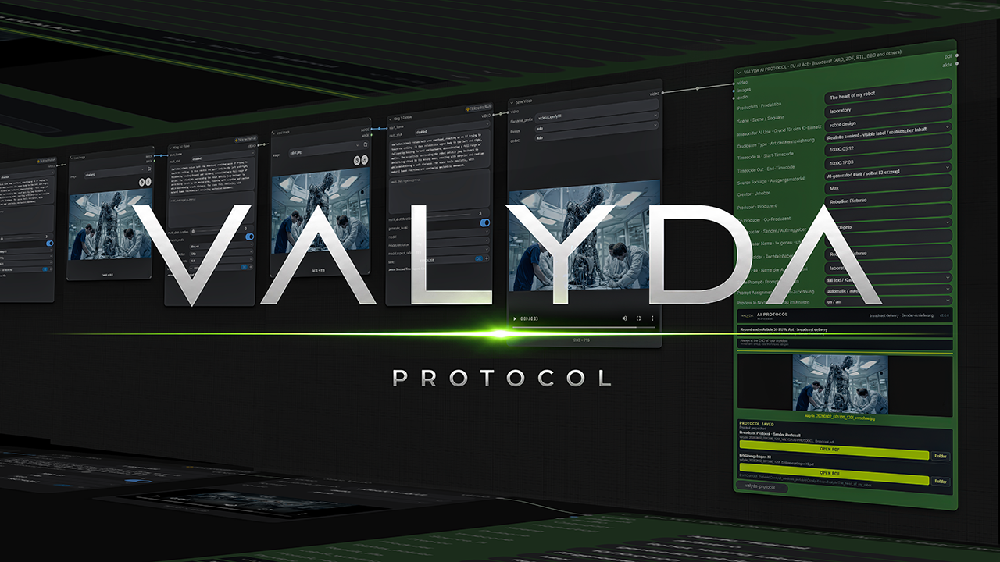
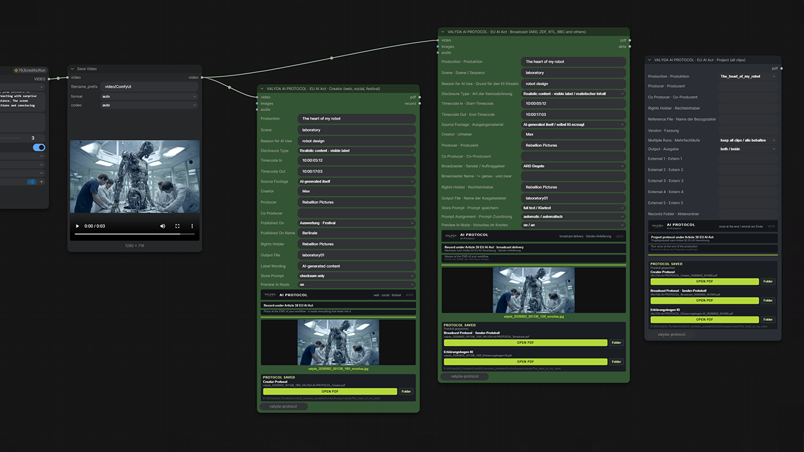
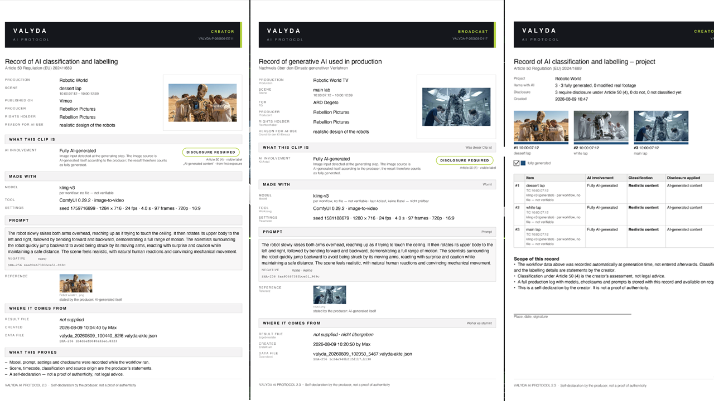

# VALYDA-Protocol

ComfyUI Node that turns compliance with the EU AI Act from a tedious task into a matter of a few clicks



Since August 2, 2026, Article 50 of the EU AI Act has been in force. If you publish AI-generated images, video, or voice, you're required to label it — and prove you did. Broadcasters like ARD, ZDF, ORF, ARTE, and Degeto go further, contractually requiring a full production record, right down to the prompt.

Tracking all of that by hand is slow and easy to get wrong. VALYDA Protocol does it automatically, every time you render.

---

## What VALYDA Protocol does

Drop one node onto the end of your workflow. Every render then ships with a ready-to-send PDF covering everything a broadcaster or client will ask for:

- which model was run, with a checksum for every file loaded
- the prompt, seed, sampler, steps, resolution, frame rate, duration
- whether a real image was used in the workflow or everything was generated from text
- which source images were used, with a preview
- a preview image of your result; for audio, a waveform

All of it is pulled straight from your workflow — no manual entry, no copy-pasting metadata.

There's exactly one thing no algorithm can decide for you: does this clip need a label?  
A photorealistic car — yes. A dragon — no. You make that call, and it's recorded in the document as

---

## What VALYDA Protocol Offers : Three Nodes



**Creator Node**  
built for anything that goes online: social, your website, festival submissions. One field, and you're covered.

**Broadcast Node**  
built for delivery to European broadcast stations and streaming platforms like Netflix, Amazon, HBO etc..  
Four fields, and if you enter "ARD" or "Degeto" as the broadcaster, you also get the AI Declaration Form pre-filled — straight out of the Degeto contract.

**Project Node**  
run it once at wrap. It rolls every clip from a full production into a single, deliverable document.

Creator or Broadcast plug directly into your workflow.  
Project use as stand alone — it reads the saved records straight off disk.

---

## Installation of VALYDA Protocol

Find VALYDA in the ComfyUI Manager and install it in one click.  
Manual install:

```
cd ComfyUI/custom_nodes
git clone https://github.com/RebellionPictures/Valyda-Protocol
pip install -r Valyda-Protocol/requirements.txt
```

Lightweight by design and easy to use:  
no models to download, no network calls and no GPU required.

---

## Where VALYDA Protocol saves your documents



```
ComfyUI/output/valyda/<production-name>/
```

You'll find the PDF there, plus the same data as machine-readable JSON, a preview image, and every detected source image. The node shows you the file name and path after every run — one click, and it's open.

Running ComfyUI on a rented machine? The Open PDF / Download button brings the document straight into your browser.

---

## What VALYDA Protocol doesn't do

It won't detect AI in someone else's footage — nobody can do that reliably yet, and we're not going to pretend otherwise. What VALYDA Protocol does is document how you worked.

It doesn't guarantee legal compliance. Whether a production meets the regulation is a call for a regulator, not a piece of software. The document is a self-declaration by the producer, and it says so on every page.

It's not legal advice — the Article 50 classification is always the producer's call.

---

## The principle behind VALYDA Protocol

We don't claim anything we haven't measured.

Anything the tool reads directly from your workflow is logged as a measurement. Anything you enter is logged right next to it, clearly marked as your input. If a value's missing, the document says so — never a guess, never a placeholder.

That's what makes the sheet something a broadcaster can actually rely on.

---

## License and Origin

MIT License

Copyright (c) 2026 Rebellion Pictures

Permission is hereby granted, free of charge, to any person obtaining a copy  
of this software and associated documentation files (the "Software"), to deal  
in the Software without restriction, including without limitation the rights  
to use, copy, modify, merge, publish, distribute, sublicense, and/or sell  
copies of the Software, and to permit persons to whom the Software is  
furnished to do so, subject to the following conditions:

The above copyright notice and this permission notice shall be included in all  
copies or substantial portions of the Software.

THE SOFTWARE IS PROVIDED "AS IS", WITHOUT WARRANTY OF ANY KIND, EXPRESS OR  
IMPLIED, INCLUDING BUT NOT LIMITED TO THE WARRANTIES OF MERCHANTABILITY,  
FITNESS FOR A PARTICULAR PURPOSE AND NONINFRINGEMENT. IN NO EVENT SHALL THE  
AUTHORS OR COPYRIGHT HOLDERS BE LIABLE FOR ANY CLAIM, DAMAGES OR OTHER  
LIABILITY, WHETHER IN AN ACTION OF CONTRACT, TORT OR OTHERWISE, ARISING FROM,  
OUT OF OR IN CONNECTION WITH THE SOFTWARE OR THE USE OR OTHER DEALINGS IN THE  
SOFTWARE.

Developed by Rebellion Pictures  
VALYDA and the VALYDA emblem are trademarks of Rebellion Pictures  
the license covers the source code only, not the use of name or emblem
